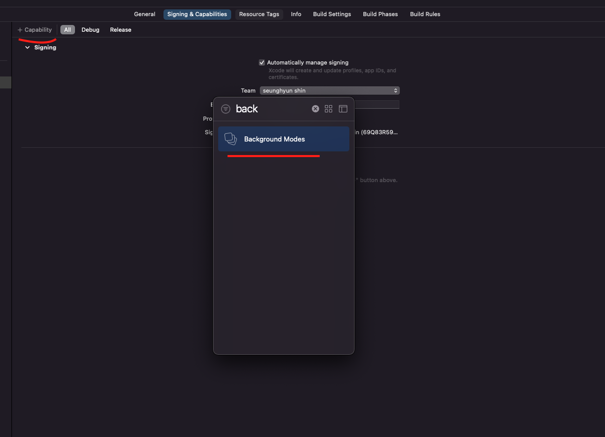
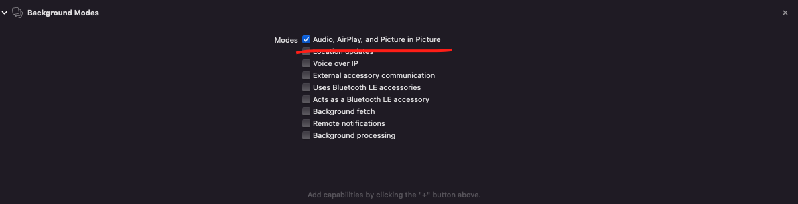

# BackgroundSession

When you create apps like alarm app, of which apps need code execution in background, this library can be useful.
I also attached callkit because sometimes background tasks are interrupted when a phone call event occurs.

# Installation

```bash
https://github.com/paigeshin/SwiftBackgroundSession
```

# Activate Background Mode





# Usage

```swift
import SwiftUI
import BackgroundSession

struct ContentView: View {
    var body: some View {
        Text("Hello, world!")
            .padding()
            .onAppear {
                BackgroundSession().keepAlive()
            }
    }
}
```
